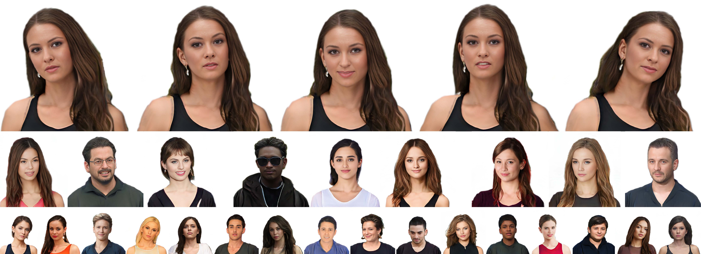

# AniPortraitGAN: Animatable 3D Portrait Generation from 2D Image Collections

This is a pytorch implementation of the following paper:

Yue Wu*, Sicheng Xu*, Jianfeng Xiang, Fangyun Wei, Qifeng Chen, Jiaolong Yang, Xin Tong. **AniPortraitGAN: Animatable 3D Portrait Generation from 2D Image Collections**, SIGGRAPH Asia 2023.

### [Project page](https://yuewuhkust.github.io/AniPortraitGAN/) | [Paper](https://arxiv.org/abs/2309.02186) | [Video](https://www.youtube.com/watch?v=DM6mCQ03umc) ###



Abstract: _Previous animatable 3D-aware GANs for human generation have primarily focused on either the human head or full body. However, head-only videos are relatively uncommon in real life, and full body generation typically does not deal with facial expression control and still has challenges in generating high-quality results. Towards applicable video avatars, we present an animatable 3D-aware GAN that generates portrait images with controllable facial expression, head pose, and shoulder movements. For this new task, we base our method on the generative radiance manifold representation and equip it with learnable facial and head-shoulder deformations. A dual-camera rendering and adversarial learning scheme is proposed to improve the quality of the generated faces, which is critical for portrait images. A pose deformation processing network is developed to generate plausible deformations for challenging regions such as long hair. Experiments show that our method, trained on unstructured 2D images, can generate diverse and high-quality 3D portraits with desired control over different properties.._


## To do
- [X] Release inference code
- [X] Release pretrained checkpoints

## Requirements
- Currently only Linux is supported.
- 64-bit Python 3.8 installation or newer. We recommend Anaconda3.
- One or more high-end NVIDIA GPUs with NVIDIA drivers installed. Our code is tested with NVIDIA V100 and A100 GPUs.

## Installation
- Clone the repository and setup the environment with all dependencies as follows:
    ```
    git clone https://github.com/YueWuHKUST/AniPortraitGAN.git
    cd AniPortraitGAN
    conda env create -f environment.yml
    conda activate aniPortraitGAN
    ```

- Download `SMPL_NEUTRAL.pkl` following the instructions in [SMPL-X](https://github.com/vchoutas/smplx). Then put it in the `smpl_models/smpl` folder. Don't forget to remove Chumpy objects in the pickle file. See [here](https://github.com/vchoutas/smplx#smpl-and-smplh-setup) for more details. 


## Pretrained Models
Pretrained model is stored within this repository. You can find them in the `ckpts` folder. The detailed description of the pretrained model is as follows:
| File | Description | Config |
| :-: | :-: | :-: |
| [sshq512](https://github.com/YueWuHKUST/AniPortraitGAN/blob/main/ckpts/sshq512.pt) | 512x512 resolution model trained on the SSHQ dataset | SSHQ512_inf

## Inference
To generate videos of generated 3D portraits with different expressions, head poses, shoulder movements and camera trajectories, run the following command:

```
python gen_video.py

Options:
    # General options
    --ckpt              Path to the checkpoint file. (default: ckpts/sshq512.pt)
    --config            Config name. (default: SSHQ512_inf)
    --output_dir        Output directory.
    --seeds             Random seeds.
    --psi               Truncation psi. (default: 0.7)

    # Video options
    --exp_path          Path to the expression keyframes npy file.
    --pose_path         Path to the pose keyframes npy file.
    --cam_path          Path to the camera keyframes npy file.
    --n_interval        Number of interpolation frames between two keyframes.
    --cam_yaw_range     Range of camera yaw angle when rotating.
    --cam_cycle         Cycle of camera rotation.
    --video_length      Length of the generated video.
    --fps               FPS of the generated video.
    --ext               Video extension. (default: mp4)

Examples:
    # Generate videos of 3D portraits with different expressions
    python gen_video.py --output_dir video --exp_path keyframes/expression.npy --n_interval 30 --fps 30

    # Generate videos of 3D portraits with different head poses
    python gen_video.py --output_dir video --pose_path keyframes/pose.npy --n_interval 30 --fps 30

    # Generate videos of 3D portraits driven by real videos
    python gen_video.py --output_dir video --exp_path keyframes/real_video_examples/sample1/expression.npy --pose_path keyframes/real_video_examples/sample1/joint_eulers.npy --cam_path keyframes/real_video_examples/sample1/camera_pose.npy --n_interval 1 --fps 12.5
```

The generated videos is controlled by the keyframes of expression, pose and camera. You can find the example keyframes in the `keyframes` folder. The keyframes are stored in the npy format. The shape of the keyframes is listed as follows:

| Keyframes | Shape | Description |
| :-: | :-: | :-: |
| Expression | [N, 64] | Coefficients of the expression PCA space in [Deep3DFaceRecon](https://github.com/sicxu/Deep3DFaceRecon_pytorch)
| Pose | [N, 6, 3] | Euler angles for SMPL joints [12, 13, 14, 15, 16, 17]
| Camera | [N, 2] | Camera yaw and pitch angles


## Dataset
###  SHHQ-HS Dataset
SHHQ-HS is built upon the SHHQ [2] dataset. We provide processed head-shoulder images at the resolusion of 512x512, and some labels used in our paper (e.g., camera pose, SMPL joint pose and shape parameters, 3DMM identity and expression coefficients). Cropped face images are also provided.

### Download Instructions
1. To obtain SHHQ-HS, you need first apply for SHHQ dataset, following [their instructions](https://github.com/stylegan-human/StyleGAN-Human/blob/main/docs/Dataset.md#download-instructions).
2. After completing the application for the SHHQ dataset, please forward the application email thread to Yue wu(wu.kathrina@gmail.com), with the email subject as "Application for SHHQ-HS Dataset". We will verify your request and contact you with the dataset link.

## Citation
Please cite the our paper if this work helps your research:

``````
@inproceedings{yue2023aniportraitgan,
    title     = {AniPortraitGAN: Animatable 3D Portrait Generation from 2D Image Collections},
    author    = {Wu, Yue and Xu, Sicheng and Xiang, Jianfeng and Wei, Fangyun and Chen, Qifeng and Yang, Jiaolong and Tong, Xin},
    booktitle = {SIGGRAPH Asia 2023 Conference Proceedings},
    year      = {2023}
}
``````

If you use the SHHQ-HS dataset, please also cite:
``````
@article{fu2022styleganhuman,
title={StyleGAN-Human: A Data-Centric Odyssey of Human Generation}, 
author={Fu, Jianglin and Li, Shikai and Jiang, Yuming and Lin, Kwan-Yee and Qian, Chen and Loy, Chen-Change and Wu, Wayne and Liu, Ziwei},
journal   = {arXiv preprint},
volume    = {arXiv:2204.11823},
year    = {2022}
``````